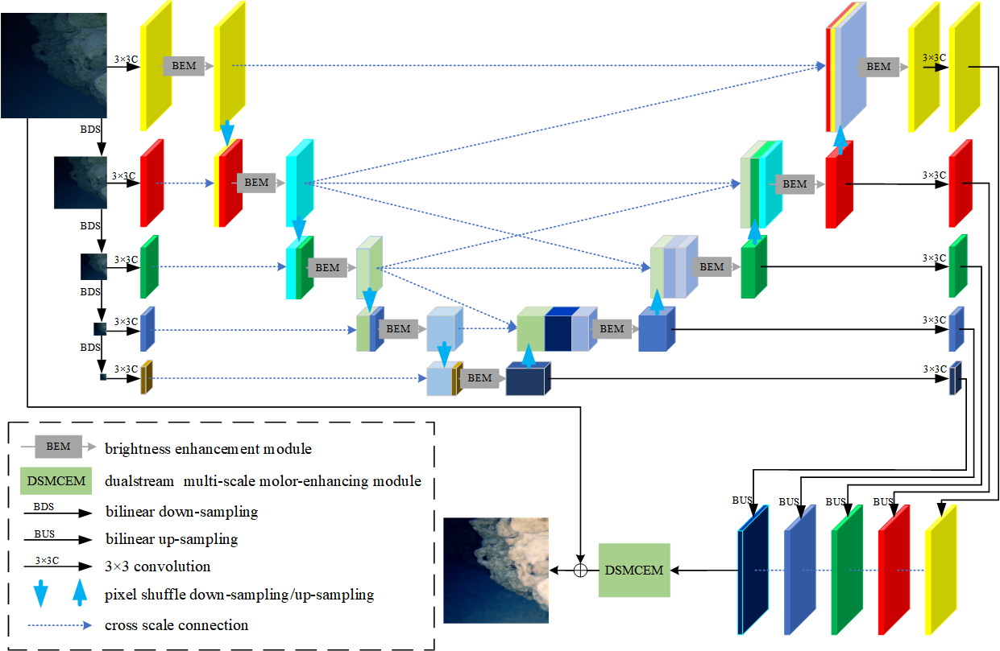

# [Laser & Optoelectronics Progress] ULCF Net: Underwater Dark Light Image Enhancement Algorithm Based on Cross Scale Structure and Color Fusion

<div align="center">


**Tao Yang,  Tan Hao,  Zhou Liqun**


</div>

### ✨ Abstract

*Underwater optical images, as an important carrier for close range information
collection, are important means for underwater biological detection, environmental
monitoring, and geological exploration. However, with the increase in shooting depth, there
are problems with low brightness, color shift, and blurred details in the images. Therefore, ULCF-Net was designed to address these issues. Firstly, the brightness enhancement module
was designed based on the half channel Fourier transform, which enhances the response in
the dark region by combining frequency domain and spatial information. Secondly, the cross
scale connections were introduced in the encoding and decoding structure to enhance the
detailed expression of underwater optical images. Finally, the dual stream multi-scale color
enhancement module was designed to improve the color fusion effect of different levels of
features. The experimental results on publicly available underwater low light image datasets
show that the ULCF-Net proposed in this paper has excellent enhancement effects in
brightness, color, and details.*

### 🧠 Pipline


## 🆕 Updates
- `20.05.2026` 🖥️ The experimental source code has been made public, due to computer updates and iterations, some weights have been lost and are no longer available. By the way, why is there mention of another person? Because she has been through this learning journey and stopped at work.
- `23.09.2025` 💔 Unfortunately, the author ultimately broke up with his girlfriend due to years of accumulated conflicts? But what can be certain is that durian is the trigger! **Inconsistent values** are essential! **Cold violence** is the norm! **Transferring to another love** is fundamental! **Breaking up** is an inevitable outcome!
- `27.07.2025` 😞 The author's girlfriend is having a conflict with him for some inexplicable reason, even though he always maintains a humble state !
- `23.06.2025` 🎓 The author of this article attracted graduation and the beautiful life he was looking forward to ...
- `21.02.2025` 📢 ULCF-Net is published as a Laser & Optoelectronics Progress Letters paper. [Link to paper](https://www.opticsjournal.net/Articles/OJ6b708f4d40d2726b/Abstract?alichlgref=https%3A%2F%2Fcn.bing.com%2F).
- `13.06.2024` 🧪 This article has entered the online first release status.
- `01.06.2024` 🤗 ULCF-Net was accepted by Laser & Optoelectronics Progress, HAHAHA!
- `27.05.2024` 🐞 ULCF-Net has undergone a major revision.
- `30.04.2024` 📝 ULCF-Net was manuscript received by Laser & Optoelectronics Progress.
- `30.03.2024` 📄 The initial draft of this article has been completed.
- `14.01.2024` 🚀🥳 The experiment of the article and **LOVE** emerged one after another.


## 🖼️ Results

### 🏆 Objective Results 
#### 📊 1 Objective Results with LLIEA On Test Set A 

| Methods            |     PSNR ↑     |    SSIM ↑     |     MSE ↓     |    LPIPS ↓    |    UIQM ↑     |    UCIQE ↑    |
|:-------------------|:--------------:|:-------------:|:-------------:|:-------------:|:-------------:|:-------------:|
| LAU-Net            |    21.4683     |    0.8601     | <u>0.0078</u> |    0.1239     |    3.1583     |    0.5993     |
| HWMNet             |    20.2836     |    0.8374     |    0.0105     |    0.1544     |    3.1796     |    0.5912     |
| RetinexFormer      |    20.7749     |    0.8565     |    0.0099     |    0.1246     |    3.0783     |    0.5895     |
| Enlighten-anything |    15.3281     |    0.7225     |    0.0324     |    0.2683     |    2.8506     |    0.5384     |
| FourLLIE           | <u>21.6478</u> |    0.8537     |    0.0085     |    0.1273     |  **3.2599**   | <u>0.6063</u> |
| CDAN               |    20.9618     | <u>0.8676</u> |    0.0094     | <u>0.1184</u> | <u>3.2080</u> |    0.6015     |
| **ULCF-Net**       |  **23.2729**   |  **0.8781**   |  **0.0053**   |  **0.0923**   |    3.1150     |  **0.6106**   |


#### 🌊 2 Objective Results with UIEA On Test Set A 

| Method             | PSNR↑          | SSIM↑         | MSE↓          | LPIPS↓        | UIQM↑         | UCIQE↑        |
|--------------------|----------------|---------------|---------------|---------------|---------------|---------------|
| LDS-Net            | 18.1289        | 0.7950        | 0.0167        | 0.1885        | **3.2921**    | 0.5702        |
| U-shape            | <u>22.5064</u> | 0.7736        | <u>0.0066</u> | 0.1635        | <u>3.2169</u> | 0.5807        |
| FiveA+             | 21.8892        | <u>0.8562</u> | 0.0078        | 0.1294        | 3.1693        | 0.5931        |
| LANet              | 21.3721        | 0.8316        | 0.0092        | <u>0.1029</u> | 3.0498        | <u>0.6099</u> |
| STSC               | 18.5456        | 0.5483        | 0.0164        | 0.1205        | 3.0935        | 0.5995        |
| Shallow-uwnet      | 12.8915        | 0.6448        | 0.0608        | 0.2186        | 2.8725        | 0.2946        |
| **ULCF-Net**       | **23.2729**    | **0.8781**    | **0.0053**    | **0.0923**    | 3.1150        | **0.6106**    |


#### 📊 3 Objective Evaluation Results on Test Set C

| Method            | UIQM↑         | UCIQE↑        |
|-------------------|---------------|---------------|
| LDS-Net           | **2.7827**    | 0.5672        |
| HWMNet            | 2.4927        | <u>0.5898</u> |
| Enlightn-anything | 1.5338        | 0.5591        |
| FourLLIE          | <u>2.7137</u> | 0.5842        |
| CDAN              | 2.4573        | 0.5758        |
| LAU-Net           | 2.2548        | 0.5830        |
| STSC              | 2.5992        | 0.5861        |
| Shallow-uwnet     | 1.8127        | 0.5335        |
| **ULCF-Net**      | 2.3703        | **0.5916**    |

#### 📡 4 Objective Evaluation Results on FPM


### 🌌 Subjective Results
#### ✨ 1 Subjective Results with LLIEA On Test Set A 

#### 🧊 2 Subjective Results with UIEA On Test Set A 

#### 🔬 3 Subjective Evaluation Results on Test Set C


### 🧪 Ablation Experiment
#### 🧩 1 Module to Module Ablation Experiment
| BEM(a) | BEM(b) | SKFF | DSMCEM | PSNR↑          | SSIM↑         | MSE↓          |
|--------|--------|------|--------|----------------|---------------|---------------|
|        |        |      |        | 15.4485        | 0.6912        | 0.0305        |
| √      |        |      |        | 17.1021        | 0.7573        | 0.0216        |
| √      |        | √    |        | 19.9057        | 0.8341        | 0.0116        |
| √      |        |      | √      | 19.7985        | 0.8328        | 0.0119        |
|        | √      |      |        | 16.8362        | 0.7656        | 0.0248        |
|        | √      | √    |        | <u>22.8939</u> | <u>0.8712</u> | <u>0.0059</u> |
|        | √      |      | √      | **23.2729**    | **0.8781**    | **0.0053**    |

#### 🔗 2 Cross scale connection Ablation Experiment

| a  | b  | c  | PSNR↑       | SSIM↑       | MSE↓         |
|----|----|----|-------------|-------------|--------------|
| √  |    |    | 22.8718     | 0.8699      | 0.0063       |
|    | √  |    | 23.1546     | 0.8701      | 0.0062       |
|    |    | √  | **23.2729** | **0.8781**  | **0.0053**   |


## 📈 Experiment


### 1. Prepare Datasets
Download the LUIE datasets:

LUIE - [LDS-Net](https://github.com/yuxiao17/LDS-Net)


**Note:** Under the main directory, create a folder called ```datasets``` and place the dataset folders inside it.
<details>
  <summary>
  <b>Datasets should be organized as follows:</b>
  </summary>

  ```
    |--datasets   
    |    |--LUIE
    |    |    |--Train
    |    |    |    |--input
    |    |    |    |     ...
    |    |    |    |--target
    |    |    |    |     ...
    |    |    |--Test
    |    |    |    |--input
    |    |    |    |     ...
    |    |    |    |--target
    |    |    |    |     ...
  ```

</details>

**Note:** make sure ```training.yaml``` components are correct.
<details>
  <summary>
  <b>Config files should be organized as follows:</b>
  </summary>

  ```
# Training configuration
GPU: [0,1,2,3]

VERBOSE: False

MODEL:
  MODE: 'ULCFNET'

# Optimization arguments.
OPTIM:
  BATCH: 2
  EPOCHS: 100
  # EPOCH_DECAY: [10]
  LR_INITIAL: 2e-4
  LR_MIN: 1e-6
  # BETA1: 0.9

TRAINING:
  VAL_AFTER_EVERY: 1
  RESUME: False
  TRAIN_PS: 256
  VAL_PS: 256
  TRAIN_DIR: './datasets/LUIE/train'       # path to training data
  VAL_DIR: './datasets/LUIE/test' # path to validation data
  SAVE_DIR: './checkpoints_ULCFNet'           # path to save models and images
  ```

</details>

### 2. ULCF-Net models
Pre-trained weights are available at [Google Drive](https://drive.google.com/file/d/1H8plvs3Pn4ZXQeNpWaEvhVKxib9L6Ab5/view?usp=drive_link).

<details>
  <summary>
  <b>All the ULCFNet models are prepared under model/All_MyNet:</b>
  </summary>

  ```
    |--model  
    |    |--All_Nets
    |    |    |...
    |    |    |HFMMNET2C_SKFF2
 
  ```

</details>

**Note:** The HFMMNET2C_SKFF2 is the pipline, the others are prepared for ablation experiment.

### 3. Test
You can test the model using the following commands. 

```bash
python demo.py
```

**Note:** Please modify the dataset paths in ```demo.py``` as per your requirements.


### 4. Train
You can train the model using the following command:

```bash
python train.py
```

**Note:** Please modify the dataset paths in ```train.py``` as per your requirements, make sure the environment is piped.


## 📚 Citation
```
[1]陶洋,谭浩,周立群.ULCF-Net：跨尺度结构与色彩融合的水下低照度图像增强算法[J].激光与光电子学进展,2025,62(02):430-440.
```
